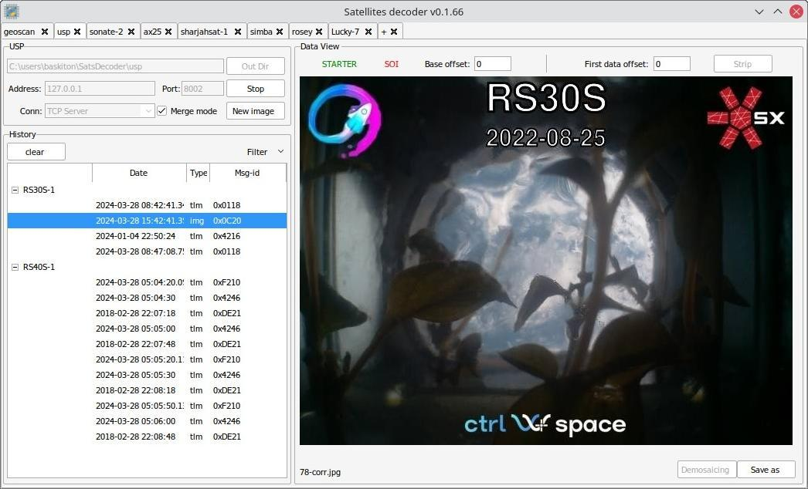

# Satellites decoder


  


Image and Telemetry decoder for some amateurs satellites (geoscan, sputnix platforms...)

First, download, setup and run soundmodem  
https://r4uab.ru/settings-soundmodem/  
* geoscan: [1](https://r4uab.ru/program/modem/geoscan.zip)
* usp: [1](https://edu.sputnix.ru/assets/files/hs_soundmodem-4c5cea0c92a6d1e2d686662c6b3115a8.zip), [2](http://uz7.ho.ua/gmskusp.zip)
* lucky-7: [1](http://uz7.ho.ua/lucky7.zip)
* other: [1](http://uz7.ho.ua/packetradio.htm)

To start decoding, run SatsDecoder, select protocol tab and press "Connect" button. Play FM demodulated signal
and wait for result.

#### Options
* `Out Dir` Directory to store result images and telemetry
* `Server` Hostname or IP-address of soundmodem
* `Port` Port of soundmodem (see in File -> Devices -> AGWPE Server Port)
* `Merge mode` When enabled, all new images data will store to one file
* `New Image` Force a new image


#### Hotkeys
* `Ctrl-Q` Quit
* `F1` Show About window, check if newer version available


#### Protocols
The following protocols are currently supported:
* `GEOSCAN` - [Geoscan platform](https://download.geoscan.aero/site-files/%D0%9F%D1%80%D0%BE%D1%82%D0%BE%D0%BA%D0%BE%D0%BB%20%D0%BF%D0%B5%D1%80%D0%B5%D0%B4%D0%B0%D1%87%D0%B8%20%D1%82%D0%B5%D0%BB%D0%B5%D0%BC%D0%B5%D1%82%D1%80%D0%B8%D0%B8.pdf)
* `USP` - [Unified SPUTNIX protocol](https://sputnix.ru/tpl/docs/amateurs/%D0%9E%D0%BF%D0%B8%D1%81%D0%B0%D0%BD%D0%B8%D0%B5%20%D0%BF%D1%80%D0%BE%D1%82%D0%BE%D0%BA%D0%BE%D0%BB%D0%B0%20USP%20v1.04.pdf)
* `AX.25`
* `CSP` - [Cubesat Space Protocol](https://github.com/libcsp/libcsp)
* `D-Star ONE` - [D-Star ONE Protocol](https://web.archive.org/web/20190807184852/http://www.d-star.one/downloads/D-Star%20ONE%20telemetry%20frame%20format.pdf)
* `CitGardens-02` - [CIT Gardens-02 project](https://sites.google.com/view/gardens-02/english_ver/home)
* `GreenCube` - [GreenCube](https://www.s5lab.space/index.php/decoding-ledsat-2/)
* `Ledsat` - [LEDSAT](https://www.s5lab.space/index.php/decoding-ledsat/)
* `Lucky-7` - [Lucky-7 Satellite protocol](https://www.lucky7satellite.org/radioamateurs)
* `RoseyCubeSat`
* `SamSat-Ionosphere` - [SamSat-Ion2 beacon structure](https://spaceresearch.ssau.ru/doc/SamSat/SamSat-Ion2/SamSat-Ionosphere-beacon.pdf)
* `SharjahSat`
* `Snuglite` - [SNUGLITE-I beacon structure](https://snuglitecubesat.wixsite.com/website/post/snuglite-beacon-structure)
* `Sonate-2` - [Sonate-2 protocol](https://www.informatik.uni-wuerzburg.de/en/aerospaceinfo/mitarbeiter/kayal/forschungsprojekte/sonate-2/information-for-radio-amateurs/)
* `WTCSimba` - [WildTrackCube-SIMBA](https://www.s5lab.space/index.php/decoding-simba/)
* `RAW` - Any raw data

#### Data Sources
Various data source types are available in the `Conn` combobox:
* `AGWPE Client` - to connect to soundmodems
* `HEX values` - per-line decoding of data transmitted as a HEX string
* `HEX values from files` - same as the `HEX values`, but from files
* `TCP Client` - TCP socket as client
* `TCP Server` - TCP socket as server
  * ATTENTION!!! For TCP types, the data provider ensures that the header is sent before the main data:  
    ```C
    struct header {  
        uint32_t len;  // data length
    }
    ```
    Byte order: Network (big-endian)
* `KISS files` - read KISS-files
* `SatDump frm files` - read SatDump frm files (only for AX.25 and Geoscan)




### Run from source
Required at least Python 3.7  
I recommend to use a virtual environment

Install required packages:
```commandline
pip install -r requirements.txt
```

To run:
```commandline
python -m SatsDecoder
```


### Build from source
Required at least Python 3.7  
I recommend to use a virtual environment

* Pyinstaller
    ```commandline
    pip install -r requirements.txt
    pip install pyinstaller
    pyinstaller -y decoder.spec
    ```

* Nuitka
    ```commandline
    pip install -r requirements.txt
    pip install nuitka
    python -m nuitka python -m nuitka --python-flag=-m --onefile --standalone \
        --assume-yes-for-downloads --output-dir=dist --script-name=SatsDecoder \
        --enable-plugins=tk-inter --windows-icon-from-ico=res/icon.png \
        --include-data-dir=res=res --noinclude-data-files=res/*.txt
    ```

The result build can be found in the `dist` folder


### Licensing
SatsDecoder is licensed under GPL-3.0-or-later. It contains third-party code
licensed as GPL-3.0-or-later, but the majority of the codebase is licensed as MIT


### Contributing
Contributions to SatsDecoder must be licensed as MIT.  
The "main" branch is the release branch.  
New branches must be created from "dev".  
All PRs must be into "dev".  
Python code must be compliant or close to the PEP-8.  
